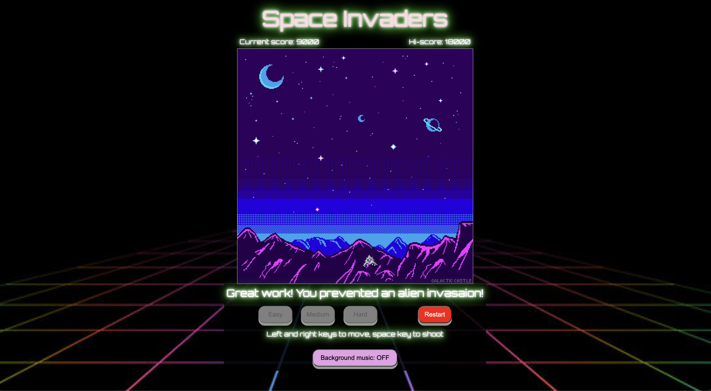
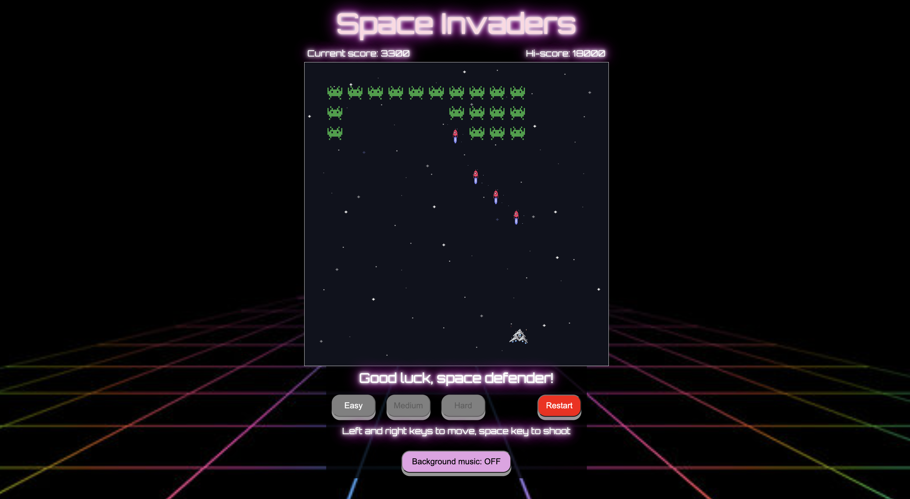
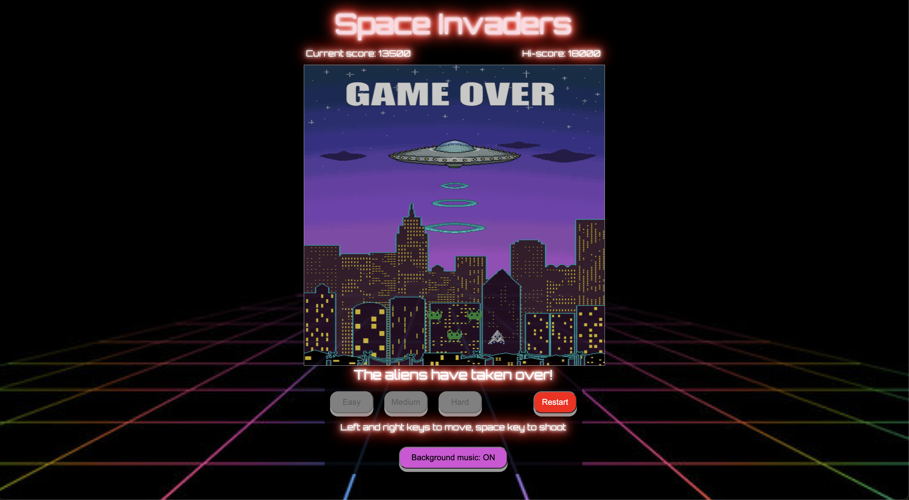

# space-invaders
Get ready to step into a time warp of nostalgic gaming glory! It's an epic throwback to the arcade heyday, where pixelated aliens are invading once more, just like they did back in the '80s. Dust off your vintage joystick, fire up your CRT screen, and embark on a journey through the galaxies of your childhood dreams. Those classic, relentless invaders are back, and they're pixelated proof that some things never go out of style. Navigate through their iconic formations, like dancing to the beat of an old-school synthesizer, and zap them into retro oblivion. It's like Pac-Man's ghostly cousins decided to invade the cosmos, and it's up to you to become the ultimate time-traveling space hero. Can you relive the golden age of gaming, beat the high score, and show these invaders that nostalgia packs a punch? Grab your leg warmers, dust off that Rubik's Cube, and get ready for a blast from the past in Space Invaders: Blast from the Past – where the '80s gaming vibes are strong, and the memories are even stronger!

#### Footnote
This is my humble remake of the legendary arcade game, Space Invaders, that was developed by Tomohiro Nishikado. Although simplified, my game consists of the same fixed-shooter frameowrk that Space Invaders first introduced to this game genre.

I hope this game successfully demonstrates all my newly acquired JS, CSS, and HTML skills!

## Gameplay - Screenshots

## Technologies Used
- JS
- CSS
- HTML

## Key Resources
- Pixiliart - for css images
- onlinegiftools - to remove the background of gifs
- W3schools

## Getting Started
Welcome to Space Invaders, the classic arcade game that puts you in charge of defending Earth from an alien invasion! Follow these simple instructions to become a master space defender:
1.	Objective: Your mission is to protect Earth from descending waves of alien invaders. Eliminate as many aliens as you can before they reach the bottom of the screen.
2.	Controls:
    - Space Bar: Press the Space Bar to fire your laser and shoot the invading aliens. Your shots travel vertically, so aim carefully!
    - Left Arrow Key: Press the Left Arrow Key to move your spaceship leftward.
    - Right Arrow Key: Press the Right Arrow Key to move your spaceship rightward.
3.	Gameplay:
    - Use the Left and Right Arrow Keys to move your spaceship horizontally along the bottom of the screen. 
    - Watch out for the alien invaders! They'll move side to side, gradually descending towards you. 
    - The aliens are organized into rows, and each row has its unique pattern of movement. 
4.	Scoring:
    - Each alien you shoot down earns you points. 
    - The harder the difficulty selected, the more points each alien is worth.
    - Your goal is to achieve the highest score possible by eliminating as many aliens as you can before they reach Earth.
    - You get bonus points for defeating all the aliens before they land on earth.
5.	Game Over and High Score:
    - The game ends when the aliens successfully reach the bottom of the screen or your spaceship comes into contact with an alien.
    - If your score is high enough, you may have you score immortalized in the Hi-score!
6.	Remember: It may seem overwhelming at first, but with practice, you'll improve your skills and become a true Space Invaders champion!
Now, suit up, grab those arrow keys, and show those pesky invaders who's boss in Space Invaders – the timeless arcade classic! Good luck, space defender

## Icebox Features
- Additional lives
- Aliens that shoot back
- Different types of aliens worth diffent amounts of points
- Aliens that speed up as they get closer to the bottom row
- Possibility of getting power ups upon killing aliens
- Different levels with different arrangements and amounts of alien invaders
- Barriers that block missiles for added difficulty