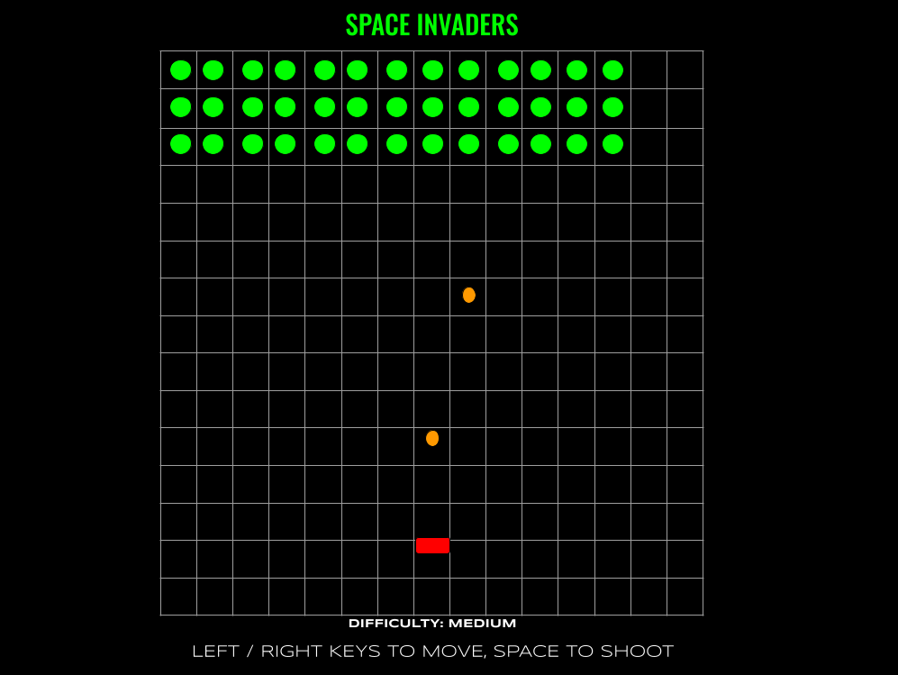

# Game Choice: Space Invaders

## Wireframes

## Psudocode
### Define constants
 - starting gameboard
 - starting alien invaders
### Define state variables
 - alien direction
 - current gameboard
 - current shooter index
 - current alien index
 - missile index
 - interval for difficulty of game
### Cache elements
 - starting gameboard
 - all grid cells
 - info message
### Event listeners
 - left key down
    - move shooter one index to the left (-1)
 - right key down
    - move shooter one index to the left (+1)
 - space key down
    - shoot projectile
    - if cell has class of missile && alien, then remove("alien")
### Functions
    - init()
        - create gameboard by looping through starting gameboard array and creating empty div for each, saving the index as the ID
        - create alien invaders by looping through starting alien invaders array and assigning the class of alien to the indexes they are on
        - render()
    - moveShooter()
        - callback function for left-right key down
    - moveAliens()
        - passed into setInterval function to move aliens by one cell every [interval]
    - check winner()
        - if no more cells with class of "alien", then player wins
    - checkLoser()
        - if "alien" class is assigned to last row, player loses
    - render()
        - renderInfo()
            - info el inner text = ${winner} wins!
        - renderWinner()
            - make winner window visible
            - add event listener to play again button
        - renderLoser()
            - make loser window visible
            - add event listener to play again button
    - removeAlien()
        - if cell class = missile and alien, remove alien
    - reset() resets the current gameboard by removing all the divs created by init()
    - moveMissile()

### Planning considerations
#### What is the gameplay loop?
    - init()
        - moveAliens()
    - eventListener()
        - moveShooter()
    - removeAlien()
    - checkWinner()
    - checkLoser()
    - render()
#### what does the user do to start the game?
    - user will select level of difficulty, which will select the interval time of the moveAlien() function
        - the harder the selection, the shorter the interval
#### how might the user interact with the game?
    - user clicks left and right keys to move the shooter in the respective directions
    - user clicks space bar to shoot missile projectile at aliens
#### what will the player do (or not do) to lose the game?
    - players will lose if they do not manage to land a missile on each alien invader
#### how will the player restart the game?
    - upon winning/losing, there will be a pop up announcing whether the player won or lost. Beneath the message, there will be a replay button which will have an event listener with a function that calls resert() init() as it's callback function
#### What data will you need to keep track of throughout your game?
    - alien direction
    - current gameboard
    - current shooter index
    - current alien index
    - missile index
    - interval for difficulty of game
#### Which elements of the game will require event listeners?
    - left key down
    - right key down
    - space key down
#### What is expected to happen after each interaction occurs?
    - shooter moves
    - missile launches and moves via a moveMissile() callback function passed through an interval

----

Planning - Due 7.24.23:
To more easily share your work with future employers, you will want to create your project in Github.com. This new Github (not GH Enterprise) repository will include your project files, a README.md, and planning materials that will be included in a planning.md file.

Your planning.md file will share:

☐ Your choice of game.

☐ A wireframe of your "main" game screen.

☐ Pseudocode for the overall game play.

Presentation - 7.28.23:
You will have a maximum of 7 minutes to present your project following these guidelines:

**Introduce the Project: **

☐ Intro your game by paraphrasing the README.

Demonstrate the Project:

☐ Launch the game by clicking the link in the README.

☐ Play the game! If necessary, manipulate the values of variables in the console to ensure a quick win or loss.

Show/discuss your code:

☐ Briefly show the HTML & CSS.

☐ Show the JavaScript and discuss your favorite function.

Share the experience:

☐ What was your biggest challenge?

☐ What are your key learnings/takeaways?

Q & A + Feedback